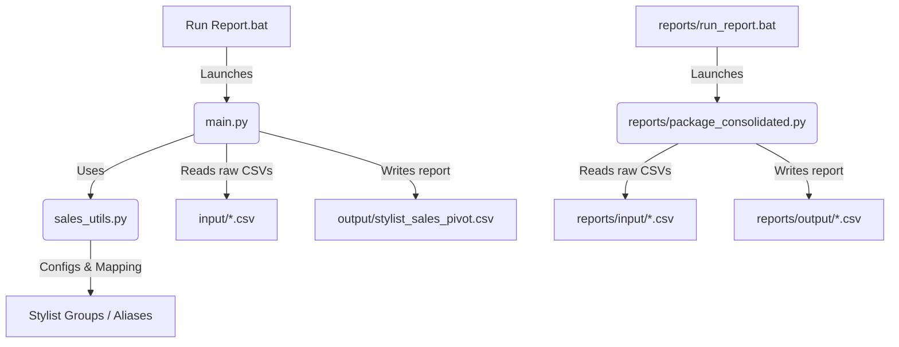

# System Architecture

The Individual Sales Automation codebase is designed as a lightweight, modular CLI utility written in Python. It relies primarily on the Python standard library to ensure ease of deployment and maintenance.

## Project Structure Diagram

## Component Breakdown

### 1. Entrypoints & Runners
- **`main.py`**: Coordinates the pipeline. Scans the `input/` directory for files, parses them row-by-row, builds the internal nested dictionary representing daily stylist sales data, and writes the summarized CSV output to `output/`.
- **`Run Report.bat`**: Windows batch runner that automatically detects Python, activates the virtual environment (`.venv`), runs `main.py`, and presents user-friendly success or failure feedback.

### 2. Utilities & Domain Logic (`sales_utils.py`)
- **`STYLIST_GROUPS`**: Dictionary defining the source-of-truth departments (HS, Nails, L&A) and the canonical names of stylists.
- **`StylistManager`**: A class that normalizes name checking. It cleans names (lowercase and whitespace removal) to lookup the canonical names and department groupings, and handles alias mapping (e.g., Nick/Nicky mappings).
- **`parse_sales_row`**: Performs pattern-matching on row structures to parse dynamic CSV column counts (13, 14, or 15 columns). It extracts dates, items, quantities, nett value, deductions, and categorizes sales type codes into Package, Product, or A la carte sales.

### 3. Isolated Reports (`reports/`)
- Directory reserved for standalone reporting scripts like `package_consolidated.py` that have specific outputs. These scripts maintain their own local input and output directories to allow standalone execution without polluting root project spaces.
